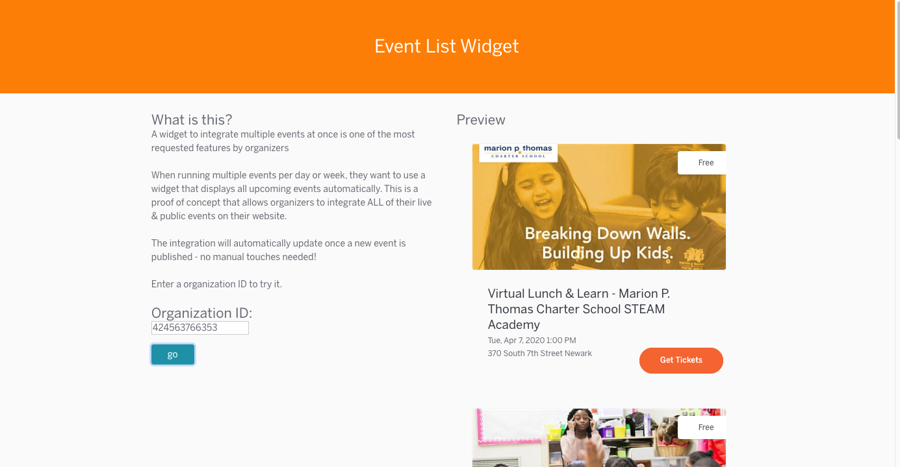

## Event List Widget 

#### One Widget to rule them all

* One of the most requested features by Organizers

 When running multiple events per day or week, the request is to display all upcoming events in one website integration. This proof of concept allows displayig ALL live & public events of one organization. 
 
* The integration will automatically update once a new event gets published - no manual touches needed. 
 

Try it out it here https://mhennigeb.github.io/Event-List-Widget/ 

